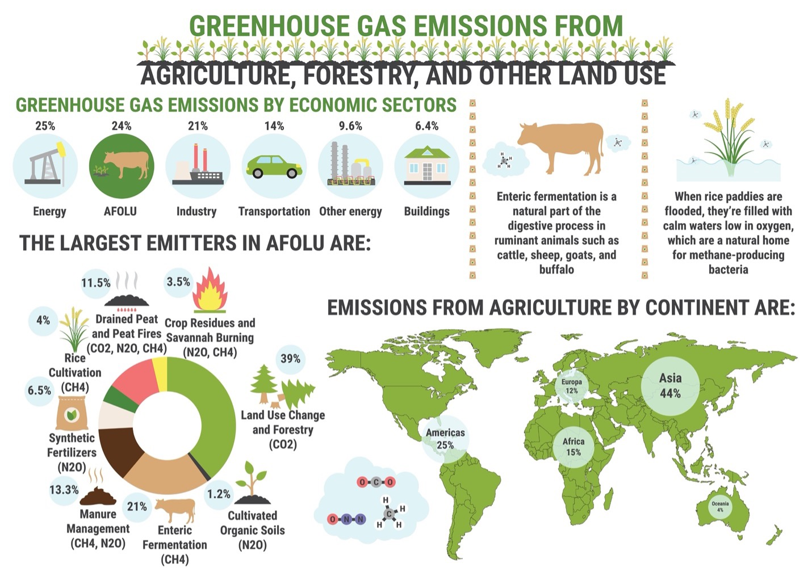
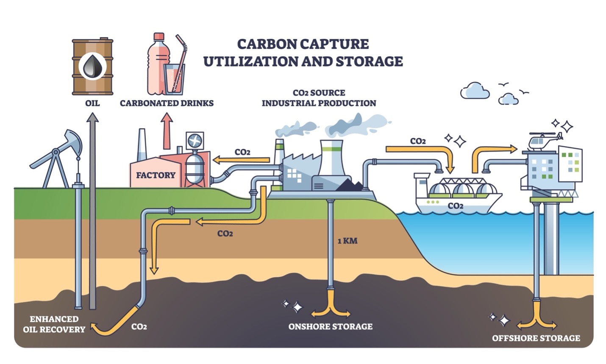

## Glossary of Key Terms in Global Methane Tracking

### Primary Sources (Sectors)

Broad economic sectors responsible for generating methane emissions.

#### Agriculture

  

The largest aggregate source of anthropogenic methane. Emissions are primarily biological.

**Key Drivers**  
• Enteric fermentation from ruminant livestock  
• Anaerobic decomposition in flooded rice paddies  

**Business Context**  
Feed additives, livestock management, and improved irrigation can reduce emissions.

#### Energy

The second-largest source and the most technologically actionable. It spans the entire fossil fuel value chain.

**Key Drivers**  
• Extraction, processing, and transport of oil, natural gas, and coal  

**Business Context**  
Methane loss represents lost product. Mitigation improves efficiency and safety.

  

#### Waste

Methane released from decomposition of organic matter in low-oxygen environments.

**Key Drivers**  
• Landfills  
• Wastewater treatment systems  

**Business Context**  
Enables “waste-to-energy” projects that convert captured methane into usable fuel.

### Energy Segments (Activities)

Specific industrial activities in the Energy sector that emit methane.

#### Onshore Oil & Gas

Land-based extraction operations.

**Onshore Oil**  
Highest-emitting energy segment.

**Onshore Gas**  
Extraction and initial processing of natural gas from land reservoirs.

#### Offshore Oil & Gas

Sea-based extraction operations with generally lower emission intensity but higher logistical challenges.

#### Midstream Infrastructure

Pipelines, compressor stations, and LNG terminals.

Emissions are often **fugitive leaks** from valves, seals, and long-distance transmission systems.

#### Coal Mining

**Steam Coal**  
Thermal coal used for power generation; a major source of coal-mine methane.

**Coking Coal**  
High-grade coal used for steelmaking.

### Emission Reasons (Mechanisms)

Operational or mechanical reasons methane is released.

#### Vented Emissions

Intentional release of unburned methane.

**Causes**  
• Pressure relief for safety  
• Gas-driven pneumatic controllers  
• Gas deemed uneconomical to transport

**Business Implication**  
Represents the most addressable emissions. Reducing venting retains saleable gas.

#### Fugitive Emissions

Unintentional methane leakage from equipment.

**Causes**  
• Worn valve seals  
• Loose flanges  
• Corrosion  
• Cracked tanks or pipes

**Business Implication**  
Often indicates maintenance issues. Requires strong LDAR (Leak Detection and Repair) programs.

#### Flared Emissions

Controlled burning of gas that cannot be processed or sold.

**Cause**  
Methane (CH₄) is combusted into carbon dioxide (CO₂). Inefficient flaring causes **methane slip**, where methane escapes unburned.

**Business Implication**  
Routine flaring is under regulatory scrutiny. Transitioning toward gas capture is a key improvement goal.

